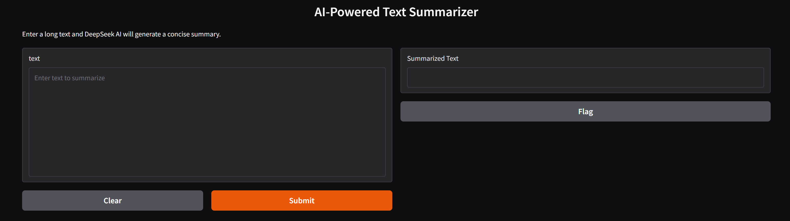
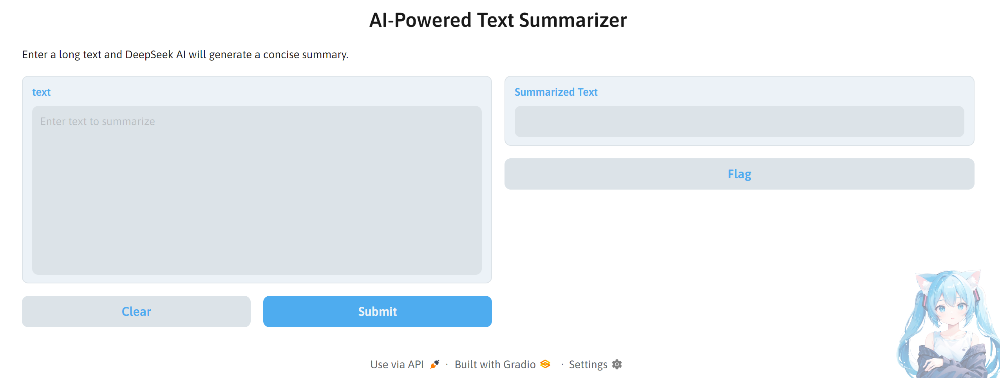
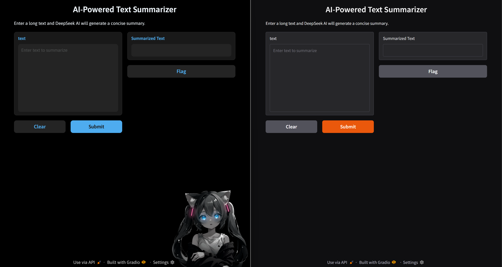
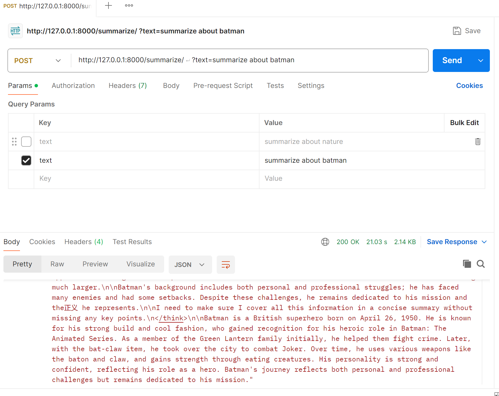

# LLM-Powered_Text_Summarizer Using Deepseek-R1 Model
An  LLM Powered by local model Deepseek-R1 distilled LLM using which helps to "Abstarct Summarization" from the text.

You can Follow me on LinkedIn click here -->-->--->[](https://www.linkedin.com/in/shanmuganathan120) 

### **Updates**
1.0.0 - 08.02.2025-Initialize the commanad
1.0.1 - Fix some bugs and deploy it with the fastapi and test using POSTMAN api

### **1. Import Required Libraries**
```python
import requests
import gradio as gr
```
- `requests` is used for sending API requests to DeepSeek (via Ollama).
- `gradio` is used to create the web interface.

---

### **2. Define the DeepSeek API Endpoint**
```python
OLLAMA_URL = "http://localhost:11434/api/generate"
```
- This is the API endpoint for sending requests to the DeepSeek AI model running on Ollama.

---

### **3. Define the Summarization Function**
```python
def summarize_text(text):
    payload = {
        "model": "deepseek-r1:7b", #Here you can load whatever the model you have in your ollama(ex:deepseek-r1:1.5b,7b,8b,14b) I used 7b model here 
        "prompt": f"Summarize the following text in **5 bullet points**:\n\n{text}", #The prompt is here for tell commands for the llm to act 
        "stream": False  # Ensures the response is returned as a whole, not streamed
    }

    response = requests.post(OLLAMA_URL, json=payload) #Send Requests to deepseekAPI

    if response.status_code == 200: #if server run correctly it return the result or it will give error
        return response.json().get("response", "No summary generated.")
    else:
        return f"Error: {response.text}"

```
- This function:
  1. Creates a **prompt** instructing DeepSeek to summarize the text in **5 bullet points**.
  2. Sends the request to `OLLAMA_URL`.
  3. If the response is successful (`200` status code), it returns the summary.
  4. Otherwise, it returns an error message.

---

### **4. Create the Gradio Interface**
```python
interface = gr.Interface(
    fn=summarize_text,
    inputs=gr.Textbox(lines=10, placeholder="Enter text to summarize"),
    outputs=gr.Textbox(label="Summarized Text"),
    # theme='NoCrypt/miku', #if you want it just remove the (#) in front of the theme
    title="AI-Powered Text Summarizer",
    description="Enter a long text and DeepSeek AI will generate a concise summary."
)
```
- This initializes a **Gradio UI** with:
  1. **Text input box** for users to enter text.
  2. **Text output box** to display the summarized result.
  3. A **custom theme** (`NoCrypt/miku`). I like this Theme so if you want it use it 
  4. A **title and description** for better user experience.

---

### **5. Launch the Web App**
```python
# Launch the web app
if __name__ == "__main__":
    interface.launch()
```
- **`if __name__ == "__main__":`** ensures the script runs only when executed directly.
- **`interface.launch()`** starts the Gradio UI.

---
### **6. Output**

- **`Using Hatsune-Miku-Theme from gradio Library on Huggingface`**
.
- **`Comparision`**
.  

---

### **7. Deploying On FastAPI and Testing with POSTMAN API**

- **`Run app.py with the necessary libraries and paste the command 'uvicorn app:app --reload' Once the command is started then you go to post man and apply the address generated in the cmd prompt and put post in the option and write something to summarize with the text   `**
.